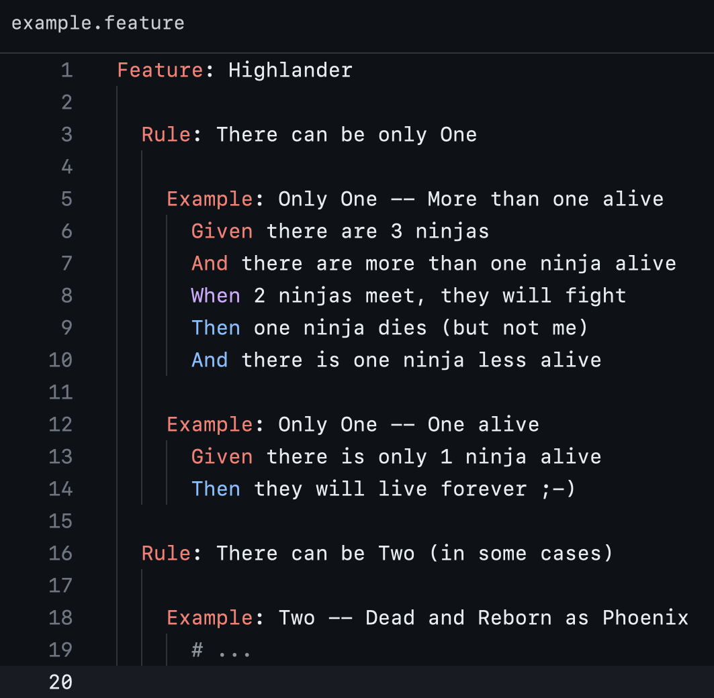

# Cucumber/Gherkin for Zed

A [Zed](https://zed.dev) extension that adds syntax highlighting for Cucumber/Gherkin `.feature` files.



## Features

- Syntax highlighting for Gherkin keywords (Feature, Scenario, Given, When, Then, And, But, etc.)
- i18n support — keywords in any language supported by Gherkin
- Tag highlighting
- Data table and doc string support
- Language injection in doc strings (e.g. ` ```json `)
- Step parameter (`<param>`) highlighting

## Install

1. Open Zed
2. Open Extensions (`Cmd+Shift+X`)
3. Search for "Cucumber" and install

### Dev install

Requirements:
- [Rust](https://rustup.rs/) (installed via rustup)
- `wasm32-wasip1` target: `rustup target add wasm32-wasip1`

```sh
git clone https://github.com/moretti/zed-cucumber
```

Then in Zed: `Cmd+Shift+P` → `zed: install dev extension` → select the cloned directory.

## Grammar

Uses [binhtran432k/tree-sitter-gherkin](https://github.com/binhtran432k/tree-sitter-gherkin).

## License

MIT
